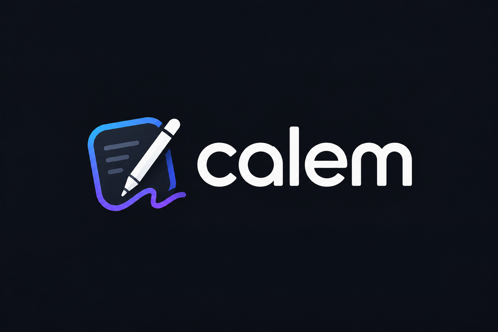

# Calem



**Zero-latency, offline-first handwriting + PDF annotation PWA for Chromebook and modern browsers.**

🚀 ** Live Version: ** [calem-r4venw4rd.vercel.app/](https://calem-r4venw4rd.vercel.app/)

Calem is a lightweight, bloat-free note-taking application optimized for fast handwriting input and PDF markup. Built for Chromebook users who need instant responsiveness without cloud overhead.

## Features

- ✍️ **Zero-latency handwriting** — instant pen/touch response, no debounce
- 📄 **PDF annotation** — import, annotate, and export PDFs
- 📱 **Responsive design** — optimized for Chromebook (portrait-first), tablets, and desktop
- 🔒 **Privacy-first** — fully offline with optional cloud sync (planned)
- ⚡ **Fast and lightweight** — PWA with service worker for instant offline access
- 🎨 **Customizable** — palettes, pen tools, paper sizes, UI themes
- 🌐 **i18n ready** — English and Turkish UI (extensible)
- 🏗️ **Modular architecture** — clean seams for auth, billing, and sync (plug-in later)

## Tech Stack

- **Vue 3** — UI framework
- **Vite** — blazing-fast dev server and build
- **TypeScript** — type-safe codebase
- **Tailwind CSS** — utility-first styling
- **IndexedDB** — local-first data storage
- **Vitest** — test runner

## Quick Start

### Prerequisites

- Node.js 22.18.0 or 24.12.0+
- npm or compatible package manager

### Installation & Development

```sh
# Install dependencies
npm install

# Start dev server (with Vue DevTools)
npm run dev

# Or minimal dev (faster, no DevTools)
npm run dev:fast
```

Visit `http://localhost:5173` and start drawing.

### Build for Production

```sh
# Type check + build
npm run build

# Preview built app
npm run preview
```

### Testing

```sh
npm run test
```

## Development

### IDE Setup

**VS Code** (recommended):
- Install [Vue - Official](https://marketplace.visualstudio.com/items?itemName=Vue.volar)
- Disable Vetur if installed
- Enable Custom Object Formatter in DevTools for better debugging

### Browser DevTools

**Chromium-based (Chrome, Edge, Brave):**
- Install [Vue.js devtools](https://chromewebstore.google.com/detail/vuejs-devtools/nhdogjmejiglipccpnnnanhbledajbpd)
- [Enable Custom Object Formatter](http://bit.ly/object-formatters) for cleaner debugging

**Firefox:**
- Install [Vue.js devtools](https://addons.mozilla.org/en-US/firefox/addon/vue-js-devtools/)
- [Enable Custom Object Formatter](https://fxdx.dev/firefox-devtools-custom-object-formatters/)

## Project Structure

```
src/
├── config/        # Constants: engine, tools, paper, palettes, membership
├── lib/           # Business logic: auth, storage, sync, billing
├── stores/        # Pinia state management
├── router/        # Vue Router navigation
├── views/         # Top-level page components
└── assets/        # Styles and static resources
tests/            # Vitest suite (~80 tests covering core logic)
public/           # PWA assets: manifest, service worker, icons
```

## Architecture Highlights

### Local-First, Cloud-Ready

- **IndexedDB storage** — all data lives locally first
- **Auth seam** — pluggable auth providers (local, email+password, OAuth planned)
- **Sync engine** — offline-first outbox pattern with conflict resolution (last-write-wins)
- **Storage interface** — abstracted to support user-scoped storage and namespacing
- **Billing seam** — extensible for Stripe/Polar/Lemon Squeezy later

### Configuration as Single Source of Truth

All behavior tuning (limits, tool metadata, UI ranges) lives in `src/config/` — one place to change, tested and locked.

## Contributing

Community contributions are welcome! Please:
1. Fork the repository
2. Create a feature branch (`git checkout -b feature/your-idea`)
3. Write tests for new logic
4. Submit a pull request

See [CONTRIBUTING.md](CONTRIBUTING.md) for guidelines.

## Roadmap

- [x] Core handwriting & PDF annotation
- [x] Responsive mobile/tablet UI
- [x] i18n (Turkish + English)
- [ ] Cloud sync (backend seams in place)
- [ ] Real authentication (email+password, OAuth)
- [ ] Billing (Stripe or Polar integration)
- [ ] Shared documents & collaboration (low priority)

See [BACKEND.md](BACKEND.md) for detailed architecture and cloud plans.

## License

Calem is licensed under the **Apache License 2.0**. Copyright ownership and authorship remain with r4venw4rd. Others can use, modify, and distribute the software freely, but the original copyright must be preserved.

See [LICENSE](LICENSE) for details.

## Support

- 📖 **Documentation** — See [BACKEND.md](BACKEND.md) for architecture details
- 🧪 **Tests** — See [TEST.md](TEST.md) for testing guide
- 🐛 **Issues** — Found a bug? [Open an issue](https://github.com/r4venw4rd/calem/issues)

---

**Made with ❤️ for offline-first note-taking** — privacy, speed, and zero bloat.
